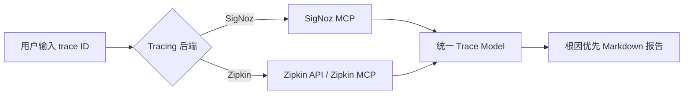

# SigNoz 链路追踪分析助手

> 一个面向 SigNoz 的 Agent Skill：给出单个 trace ID / 链路 ID，自动查询 SigNoz MCP，输出根因优先、证据清晰、可直接转发的 Markdown 分析报告，并把故障模式沉淀进 `docs/incidents/` 故障案例知识库。后续可按 Zipkin API 扩展为 Zipkin 兼容模式，让同一套“链路 ID → 根因报告”能力适配更多 tracing 后端。

## 亮点简介

生产故障排查最怕三件事：

1. trace 明明查到了，但报告太长，根因藏在中间；
2. 排查过程依赖个人经验，新同事不知道先看 span、日志还是状态码；
3. 每次故障都从头查一遍，上次怎么解决的没人记得。

`signoz-analyzing-traces` 把这套排查路径固化成一个 Agent Skill：

```text
分析这个链路：2ee9e12d2f2aecd0d9c78313adb06f8b
```

它会自动：

- 先查故障案例知识库，命中已知模式就复用历史根因与处置方案；
- 查询 SigNoz trace 详情；
- 判断成功链路、失败链路或 trace 缺失；
- 对失败链路关联 ERROR/WARN 日志；
- 提取关键 span、异常、耗时和状态矛盾；
- 在报告第一屏给出根因、失败点、影响范围和证据强度；
- 按故障指纹归档到 `docs/incidents/`（同一模式累加次数，不重复建档）；
- 询问是否保存单次分析原文为 Markdown 文档。

默认报告短而聚焦，适合直接发到群里、贴到工单、沉淀到复盘文档。

---

## 适用场景

| 场景 | 示例 |
|---|---|
| 失败链路根因分析 | “这个 trace 为啥失败：`a3b693b...`” |
| 慢链路性能分析 | “查一下 trace_id `f62db8...` 慢在哪里” |
| 故障报告生成 | “根据这个链路 ID 生成分析报告：`2ee9e12d...`” |
| 已知故障复发 | “这个报错是不是以前遇到过” → 命中知识库，直接给历史处置方案 |
| Trace 查不到排查 | 自动给出保留期、采样、环境、写入失败等可能原因 |
| 故障模式沉淀 | 每次失败分析后自动归档，积累成团队可复用的诊断经验 |

不适合：

- 统计错误率、p99、Top errors；
- 创建 dashboard；
- 写 ClickHouse SQL；
- 查询 SigNoz 使用文档；
- 配置 MCP 或接入观测。

---

## 为什么它适合分享

### 1. 根因第一屏可见

传统报告常见结构是：基本信息、调用图、span 表、日志、再到根因。读者需要往下翻。

这个 skill 强制输出：

```markdown
## 结论
- 根因：...
- 失败点：...
- 影响：...
- 证据强度：...
```

根因必须出现在前 10 行。

### 2. 自动补齐证据链

失败链路不会只看 trace span，还会尝试查询：

```text
trace_id = '<traceId>' AND severity_text IN ('ERROR', 'WARN')
```

报告会区分：

- 日志证实；
- span 推断；
- 证据不足；
- HTTP 200 但 OTel Error 等状态矛盾。

### 3. 默认短报告，不制造文档噪音

默认约束：

| 项 | 要求 |
|---|---|
| 失败链路 | 40-60 行以内 |
| 成功链路 | 25-40 行以内 |
| Mermaid | 默认不生成 |
| 代码修复 | 默认不生成 |
| 行动项 | 最多 3 条 |
| 附录 | 默认不输出 |

只有用户明确要求“详细复盘 / 画图 / 给代码修复”时才展开。

### 4. 沉淀为故障案例知识库

单次分析出的报告只是原料。同一类故障第二次出现时，能从历史案例直接复用根因和处置方案，才算经验。

因此分析分为两段：

| 阶段 | 动作 |
|---|---|
| 分析前 | 读 `docs/incidents/index.yaml`，按故障指纹匹配已有案例；强/中命中的走 Template D，复用历史结论 |
| 分析后 | 抽取指纹归档到 `docs/incidents/`，同一故障模式累加 `occurrences`，不重复建档 |

知识库结构：

```text
docs/incidents/
├── README.md       # schema 与维护约定
├── index.yaml      # 检索入口
├── _template.md    # 新案例模板
└── cases/          # 一个故障模式一个文件
```

同时仍可保存单次分析原文：

```text
docs/trace-<短traceId>-<语义标签>.md
```

---

## 使用方式

把整个 skill 目录复制到项目的 skill 目录下。ZCode 用 `.agents/skills/`（跟随 git，团队共享），Claude Code 用 `.claude/skills/`：

```text
<your-project>/.agents/skills/signoz-analyzing-traces/
```

然后直接用自然语言触发：

```text
分析这个链路：<trace_id>
```

```text
这个 trace 为啥失败：<trace_id>
```

```text
查一下 trace_id <trace_id> 慢在哪里
```

如果要直接保存报告：

```text
分析这个链路：<trace_id>，并保存为 md
```

---

## MCP 依赖说明

这个 skill 依赖 SigNoz MCP。使用前必须确保当前会话中能看到以下工具（ZCode 中全名为 `mcp__signoz__<tool>`）：

- `signoz_get_trace_details`
- `signoz_search_logs`
- `signoz_search_traces`

如果 MCP 没有配置，skill 会提示 SigNoz MCP 当前不可用，但无法真正查询链路数据。

当前项目已内置配置，共两处：

| 文件 | 说明 |
|---|---|
| `.agents/mcp.json` | 顶层 `mcpServers` 键，随 git 提交，团队共享 |
| `.zcode/config.json` | ZCode 主位置 `mcp.servers`；但本仓库 `.gitignore` 忽略了 `.zcode/`，仅本机生效 |

配置内容：

```json
{
  "mcpServers": {
    "signoz": {
      "type": "http",
      "url": "http://192.168.2.111:18000/mcp"
    }
  }
}
```

- **改地址**：两处都要改，否则团队拉到的还是旧地址。
- **生效时机**：MCP 连接与 skill 发现都发生在会话启动时，改完需重开会话；用 Settings → MCP 确认 `signoz` 已连接。
- **网络前提**：endpoint 是内网地址，使用者需在公司内网。

### 分享时不要直接附带自己的 `.mcp.json`

`.mcp.json` 可能包含内网地址、认证信息、环境绑定或私有 SigNoz endpoint。如需分享给不同环境的人，只提供配置说明，由对方按自己的 SigNoz 环境填写。当前这份配置只有内网地址、无认证信息，因此在本团队内随仓库提交是安全的。

---

## 后续扩展：Zipkin 兼容模式

当前版本面向 SigNoz MCP，核心调用是 `signoz_get_trace_details`、`signoz_search_logs` 和 `signoz_search_traces`。

后续可以扩展为 Zipkin 兼容模式，思路是把“数据获取层”和“报告生成层”解耦：



Zipkin 兼容模式可优先支持：

- 通过 trace ID 获取 span 列表；
- 解析 service、span name、duration、timestamp、tags、annotations；
- 根据 error tag / status tag / duration 找失败点或慢点；
- 输出与当前 SigNoz 模式一致的根因优先报告。

建议不要把 Zipkin 逻辑直接塞进当前 SigNoz skill 主流程，而是后续抽象成：

```text
trace backend adapter → unified trace model → report template
```

这样既能保留当前 SigNoz 使用体验，也方便接入 Zipkin、Jaeger 或其他 OpenTelemetry 后端。

---

## 输出示例

```markdown
# Trace 根因分析：票据生成失败

## 结论
- 根因：`inp-drug-service` 字典翻译阶段调用 `dict-service` 失败，底层异常是 `UnknownHostException: dict-service`。
- 失败点：`inp-drug-service` / `ResponseConverter.fetchPrimaryDataIndex`
- 影响：票据生成链路失败，但 HTTP 仍返回 200，网关层可能误判成功。
- 证据强度：日志证实。

## 关键证据
| 证据 | 说明 |
|---|---|
| `UnknownHostException: dict-service` | 直接指向服务名解析失败 |
| `Service instance was not resolved` | 说明 LoadBalancer 未解析到实例 |
| HTTP 200 + OTel Error | 网关层可能误判成功，告警可能漏报 |

## 处理建议
1. 检查 `dict-service` 服务注册、DNS 和服务发现配置。
2. 为字典翻译增加降级或兜底处理，避免主流程直接失败。
3. 修正异常状态映射，避免业务失败仍返回 HTTP 200。
```

---

## 参考资料

未找到可直接复用的“Zipkin Claude Skill / Zipkin 助手 skill”成熟实现。后续做 Zipkin 兼容时，更建议参考 Zipkin 官方 API 和数据模型，而不是照搬现成 skill。

可参考方向：

- Zipkin trace 查询 API：通过 trace ID 获取 span 列表。
- Zipkin span 模型：`traceId`、`id`、`parentId`、`name`、`timestamp`、`duration`、`localEndpoint.serviceName`、`tags`、`annotations`。
- OpenTelemetry / Jaeger / Zipkin 的共性：最终都可归一成统一 trace model，再复用当前根因优先报告模板。

---

## 推荐比赛名称与简介

**名称：** SigNoz 链路追踪分析助手

**一句话简介：**

> 输入一个 trace ID，自动查询 SigNoz span 与日志，把根因、证据和处理建议压缩到第一屏，并可沉淀为 Markdown 故障分析报告；后续可扩展为 Zipkin 兼容模式。
