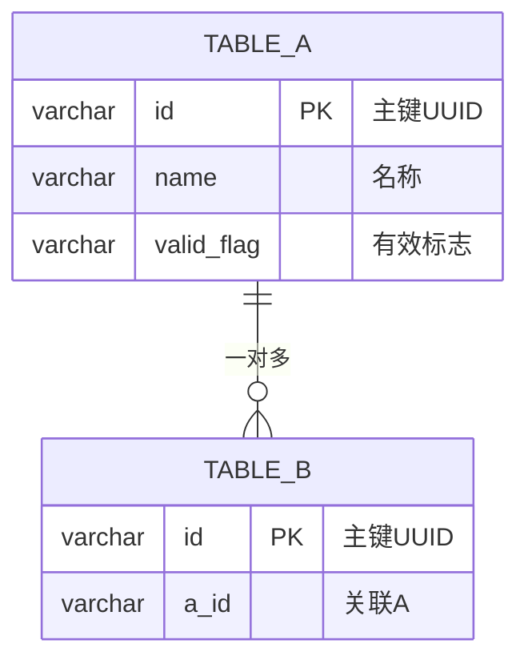
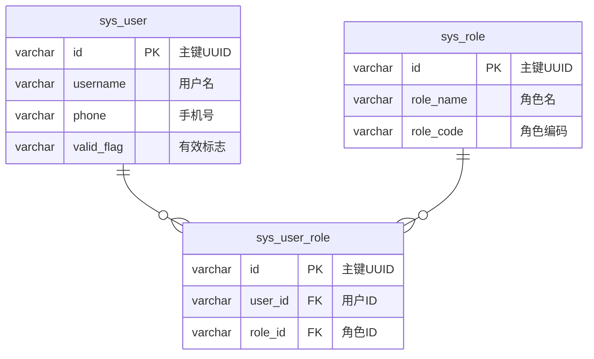

# ER 图输出格式指南

> 本文件定义 db-architect 的 ER 图输出策略，包含 Mermaid 和 draw.io 两种格式。

## 输出策略

```
用户触发 → 扫描数据库 → 生成结构数据
  → [始终] Mermaid ER 图（.mmd 文件）
  → [可选] draw.io ER 图（.drawio 文件）
```

### 为什么 Mermaid 优先

1. **零依赖**：纯文本，任何 Markdown 渲染器可看（GitHub、GitLab、VS Code、Typora）
2. **版本控制友好**：文本 diff 可追踪变化
3. **轻量**：200+ 表也能快速渲染
4. **可内嵌**：直接嵌入 Markdown 报告

### draw.io 增强场景

- 需要拖拽调整布局
- 需要导出高分辨率 PNG/SVG/PDF
- 需要自定义颜色/样式
- 需要打印或嵌入 PPT

---

## Mermaid ER 图语法

### 基本结构



### 关系线语法

| 语法 | 含义 | 适用场景 |
|------|------|---------|
| `\|\|--\|{` | 一对一 | 用户-用户详情 |
| `\|\|--o{` | 一对多 | 用户-订单 |
| `}\|--\|{` | 多对多 | 用户-角色（中间表） |
| `}\|--o{` | 多对多（可选侧） | 推断关系 |

### 字段格式

```
{type} {name} {PK|FK} "{comment}"
```

- `PK`：主键标记
- `FK`：外键标记（推断关系）
- 类型截断：`varchar(36)` → `varchar`，`decimal(10,2)` → `decimal`

### 大表处理

当表数量 > 30 时：

1. 只展示字段名含 PK/FK 的关键字段
2. 表注释改为 `"... 另有 N 个字段"`
3. 使用 `--max-tables` 参数限制表数量

### 示例（完整）



---

## draw.io ER 图生成

### 触发条件

当以下条件同时满足时，额外生成 `.drawio` 文件：

1. 用户在命令中指定 `--drawio` 参数，或对话中提及"drawio"/"可编辑ER图"
2. `drawio` skill 可用（系统检测）

未满足时，仅输出 Mermaid，并提示：

> 💡 安装 drawio skill 可生成可编辑的 .drawio ER 图

### draw.io XML 结构

ER 图采用标准实体-关系布局：

```xml
<mxGraphModel adaptiveColors="auto">
  <root>
    <mxCell id="0"/>
    <mxCell id="1" parent="0"/>
    <!-- 表实体（容器） -->
    <mxCell id="t1" value="sys_user" style="shape=table;..." parent="1" vertex="1">
      <mxGeometry x="40" y="40" width="200" height="240" as="geometry"/>
    </mxCell>
    <!-- 表头 -->
    <mxCell id="t1_h" value="sys_user" style="shape=partialRectangle;..." parent="t1" vertex="1">
      <mxGeometry y="0" width="200" height="30" as="geometry"/>
    </mxCell>
    <!-- 字段行 -->
    <mxCell id="t1_f1" value="🔑 id varchar(36)" style="shape=partialRectangle;..." parent="t1" vertex="1">
      <mxGeometry y="30" width="200" height="26" as="geometry"/>
    </mxCell>
    <!-- 关系线 -->
    <mxCell id="e1" edge="1" parent="1" source="t1" target="t2" style="endArrow=ERmandOne;startArrow=ERmany;">
      <mxGeometry relative="1" as="geometry"/>
    </mxCell>
  </root>
</mxGraphModel>
```

### 表实体样式

```
shape=table;
startSize=30;
container=1;
collapsible=0;
childLayout=tableLayout;
fontStyle=1;
align=left;
overflow=hidden;
fillColor=#dae8fc;
strokeColor=#6c8ebf;
```

### 字段行样式

| 类型 | fillColor | 标记 |
|------|-----------|------|
| 主键 | `#d5e8d4` | 🔑 |
| 外键（推断） | `#fff2cc` | 🔗 |
| 普通字段 | `#ffffff` | - |

### 关系线样式

```
edgeStyle=orthogonalEdgeStyle;
endArrow=ERmandOne;
startArrow=ERmany;
endFill=0;
startFill=0;
```

### 自动布局策略

1. 按表关联度分组（有外键关系的表靠近放置）
2. 横向间距 280px，纵向间距 200px
3. 关联最多的表居中放置
4. 孤立表放在右下角

---

## 输出文件命名

| 格式 | 文件名 | 说明 |
|------|--------|------|
| Mermaid | `er-diagram.mmd` | 纯文本，可嵌入 Markdown |
| draw.io | `er-diagram.drawio` | XML，可用 draw.io 编辑 |
| PNG | `er-diagram.drawio.png` | 需 draw.io CLI 导出 |
| SVG | `er-diagram.drawio.svg` | 需 draw.io CLI 导出 |
